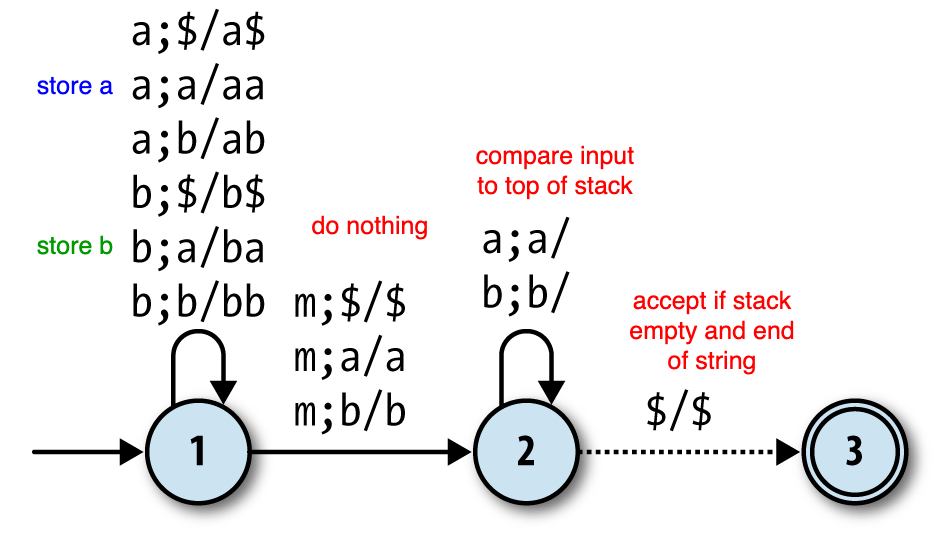

# Just Add Power

https://learning.oreilly.com/library/view/understanding-computation/9781449330071/ch04.html

This follows on from chapter 3: Finite Automata.

## Computational power
My interpretation: this is about what it's possible to compute

*non-deterministic finite automata* have the same power as *deterministic finite automata*

Finite automata have limited power because:
- they are both limited to accepting/rejecting input
- you can create a `language` that they can't recognise

This chapter covers pushdown automata, which can do some things finite automata can't. 

However these are still a limited model of computation:

- They have memory but it's not random access
- They can recognize palindromes, but they can’t recognize doubled-up strings like 'abab' and 'baaabaaa'
- Still limited to accepting/rejecting input, and the program is still fixed

## Bracket nesting level example

Problem: determine if brackets in a string are balanced `'(()(()()))'`

You can create an NFA that works for a limited number of brackets, but not for the general case.

> a finite automaton has only limited storage in the form of its fixed collection of states, which means it has **no way to keep track of an arbitrary amount of information**

## Sidenote: Regular expressions and HTML
To pattern match HTML you need to know if tags are closed, which is like the bracket nesting problem

The formal definition of regex is not powerful enough to tell if your HTML is valid

[Stack overflow rant](https://stackoverflow.com/questions/1732348/regex-match-open-tags-except-xhtml-self-contained-tags/1732454#1732454)

Ruby's Regex can technically solve these kinds of problems, because of extensions that allow recursion (not possible with a NFA)

```
balanced =
  /
    \A              # match beginning of string
    (?<brackets>    # begin subexpression called "brackets"
      \(            # match a literal opening bracket
      \g<brackets>* # match "brackets" subexpression zero or more times.   <------ RECURSION
      \)            # match a literal closing bracket
    )               # end subexpression
    *               # repeat the whole pattern zero or more times
    \z              # match end of string
  /x
 ```

## Deterministic Pushdown Automata

DPA is an extension of DFA and NFA to add *external memory* (a stack, with unlimited size)

Stack properties: last-in, first out.

```ruby
stack = [1,2,3]
stack.push(4) 
stack.pop       # --> 4
```

- With DFA and NFA each transition was based only on the input character.
- Now it's based on the input character and what's in the stack.

## Defining the rules
My interpretation: this section defines the minimal ingredients of a rule that still maximises what you can express

We keep from the DFA/NFA rules these things:

- The current state of the machine (node in the graph)
- The character that must be read from the input (optional)
- The next state of the machine 

But add these:

- The character that must be popped off the stack
- The sequence of characters to push onto the stack after the top character has been popped off

NB: You can always replace the character that was popped.

There is a special character used to mark the bottom of the stack ($). If we pop this it means the stack is empty.

## Horrific notation
`a;b/cd` means:

```
a   ;   b   /   cd

^       ^        ^
|       |        |__ push c and d back to the stack
|       |___________ if we popped b from the stack
|___________________ and read a from input
 
```

## Balanced bracket example


- stack contains a `b` for every nesting level
- when the stack is empty (parens are balanced), there is a free action to go back to the accept state

This one is deterministic because there is only one rule for every scenario. (Like with DFA)

For PDAs we don't care about specifying all possible states - there is an implicit `stuck` state if no rules apply

In this case it doesn't process `)` or `())`

## Equal numbers of two tokens in a string example
In this example, the machine is counting the number of each kind of token by putting it on the stack. It ensures that the top token on the stack is always the one that is most prevalent.

This example is equivalent to one where you store one symbol representing the surplus. The stack is just being used as a counter.

## Palindromes example
For a DPDA, the string needs to be annotated at the midpoint like this:

```
Eva, can I see bees in a cave?
e v a c a n i s e e M e e s i n a c a v e
```

This allows the DPDA to process the string in two phases:

```
e v a c a n i s e e M e e s i n a c a v e
1 1 1 1 1 1 1 1 1 1 2 2 2 2 2 2 2 2 2 2 2
```



(note: any other combination causes the machine to get stuck, and in that case you can reject the input)

Knowing when to move from 1->2 without knowing M is like not knowing how many times a pattern will appear in the previous chapter

>  As we’ve seen before with NFAs, these “how do I know when to…?” problems can be solved by relaxing the determinism constraints and allowing the machine the freedom to make that vital state change at any point, so that it’s possible for it to accept a palindrome by following the right rule at the right time.

Solution is to replace the rules about m with free moves.

## Power of DPDA vs NPDA
> There’s no way to combine all the possible stacks into a single stack so that a DPDA can still see all the topmost characters and access every possible stack individually.
>
> [...]
>
> So unfortunately, our NPDA simulation does not behave like a DPDA, and there isn’t an NPDA-to-DPDA algorithm. The unmarked palindrome problem is an example of a job where an NPDA can do something that a DPDA can’t, so nondeterministic pushdown automata really do have more power than deterministic ones.

## Ruby implementation
- defines a functional stack (creates copies instead of mutating things in place)
- like the previous chapter I found the diagrams more intuitive than the code

### What's going on in the different classes
- A `Configuration` stores state + stack
- `Rule` defines a transition between two states (implementation detail of the Rulebook)
- `Rulebook#next_configuration` takes a Configuration and an input character and returns a new Configuration
- `DPDA`/`NPDA` does the computation on an input, keeping track of the current Configuration, using a Rulebook to apply rules and follow free moves
- `DPDADesign`/`NPDADesign` is a high level api that wraps the DPDA/NPDA

The difference between the implementations of DPDA/NPDA is that NPDA stores multiple current configurations, representing all the possibilities as the input is processed. Same as the DFA/NFA stuff last chapter.

there are a lot of classes working together: Configuration, Rule, Rulebook, Simulation

## Parsing with pushdown automata
PDA can be used to parse programming languages!

Traditional parsing is lexical analysis + syntactic analysis

Lexical analysis -> sequence of tokens (can be done using regex)

Syntactic analysis -> check against syntactic grammar, maybe produce a parse tree

Context free grammar looks like this

```
<statement>  ::= <while> | <assign>
<while>      ::= 'w' '(' <expression> ')' '{' <statement> '}'
<assign>     ::= 'v' '=' <expression>
<expression> ::= <less-than>
<less-than>  ::= <multiply> '<' <less-than> | <multiply>
<multiply>   ::= <term> '*' <multiply> | <term>
<term>       ::= 'n' | 'v'
```

It can be mapped directly to a PDA.

The stack stores these grammar symbols and tokens

## Simple example with NPDA
### Setup
> When the PDA starts, have it immediately push a symbol onto the stack to represent the structure it’s trying to recognize (i.e. the root of the parse tree).

### Grammar rules
These get implemented as PDA rules that take no input and replace symbols on the stack with their expanded forms (free actions?)

These rules lead to configurations that expand the stack size. Since there are multiple possible rules to follow the PDA is non-deterministic.

### Consume input rules
For every token, there's a rule that consumes it and pops it off the stack
(this is like the 2nd part of the palindrome PDA)

These rules lead to configurations that reduce the stack size.

### Accept rule
Enter an accept state if the stack becomes empty

## In real applications, avoid NPDA 
- can convert to a deterministic version using *lookahead*
- deterministic version is faster
- record the sequence of rules followed to reconstruct the parse tree