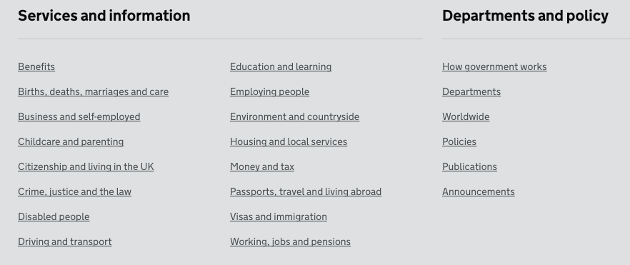
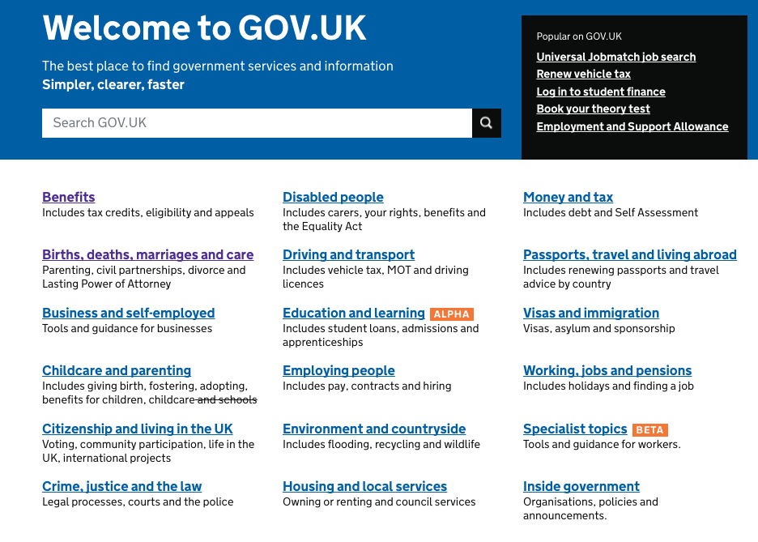

GOV.UK Frankentaxonomy
======================

This is a suggested way to join together the top level structure for GOV.UK and make navigating it more consistent. It's a "work-in-progress" taxonomy that is intended to evolve over time.

Background
--------

Currently, GOV.UK does not have a simple structure.

There are two distinct "places" on GOV.UK: "Mainstream" and "Inside government".

This structure is most visible to users in the footer at the bottom of each page:

Mainstream is very subject-oriented whereas inside government is organised primarily by organisation and policy area (so you need to understand how government works to navigate it).

This has led to multiple distinct ways of browsing by subject:
- [Mainstream browse](https://www.gov.uk/browse)
- [Organisation home pages](https://www.gov.uk/government/organisations)
- [Policy areas](https://www.gov.uk/government/topics)
- [Policies](https://www.gov.uk/government/policies)
- [Topics](https://www.gov.uk/topic) aimed at specialist users

These things currently have no relationship to each other, which makes it very difficult
to understand where you are on GOV.UK.

They also have varying scopes: each of them organises a different slice of GOV.UK content, and those slices are not meaningful to users.

Single subject-based taxonomy
-----------------------------
The GOV.UK finding things project aims to organise the whole of GOV.UK (hundreds of thousands of documents) under a common classification scheme (the "single subject-based taxonomy") so that users can quickly find and understand information on a topic.

This is being developed piece by piece starting with education content.

This mockup
-----------
The goal of this mockup is to show how the navigation structure of GOV.UK could evolve towards a single browse hierarchy while the new taxonomy is being developed.

It's called the frankentaxonomy because it's an attempt to link together multiple hierarchies so that users can understand where they are in broad terms.

 If you land in the "wrong section", you should be able to course correct; for example if you land on the "inside government" part of GOV.UK and you're actually looking for basic information about benefits entitltement, your best bet is to navigate back up the homepage and click "benefits".

In this model, the structure of those top level topics can be improved one at a time without breaking the bigger picture of how GOV.UK fits together.

Better topic pages enable larger and more complete topics
-------

In many cases, a "topic" is displayed as just a list of pages, sometimes curated curated in groups. This will not scale when a topic grows to include different kinds of content, so there should be a better way to browse within a topic. If the topic pages are flexible enough, the underlying taxonomy can evolve over time.

### Swapping in themes from the new taxonomy
The new taxonomy topics are much richer than what came before them. Topics include all content related to that subject, regardless of who the audience is or the kind of page it is.

The new topic pages should support both old and new taxonomies so that the new can be rolled out theme by theme. Since the old topics are much smaller, the information displayed for an "old style" and "new style" topic won't be exactly the same, but they should feel like part of the same structure.

Introducing a theme from the new taxonomy:
- Identify old topics that will be replaced by any of the new topics
- If any replaced topic contains child topics that aren't covered by the new topics, move them elsewhere
- Add the new topics
- Archive and redirect old topics

### Unifying existing topics

"Specialist topics" would start out containing [the current topics list](https://www.gov.uk/topic). In many cases these duplicate other "mainstream" topics, but contain different content. When there are better pages for browsing content associated with a topic, a specialist topic like [Personal Tax](https://www.gov.uk/topic/personal-tax) could be merged with a mainstream topic within [Money and Tax](https://www.gov.uk/browse/tax). In the meantime, these topics could be related to each other so that the user can navigate between them.

"Inside government" would start out containing [the current policy area list](https://www.gov.uk/government/topics), although it might be useful for the organisations hierarchy to be rooted here as well. Long term, content that is currently structured around policy area should be structured around top-level topics instead, with some organisation-focused content remaining.

